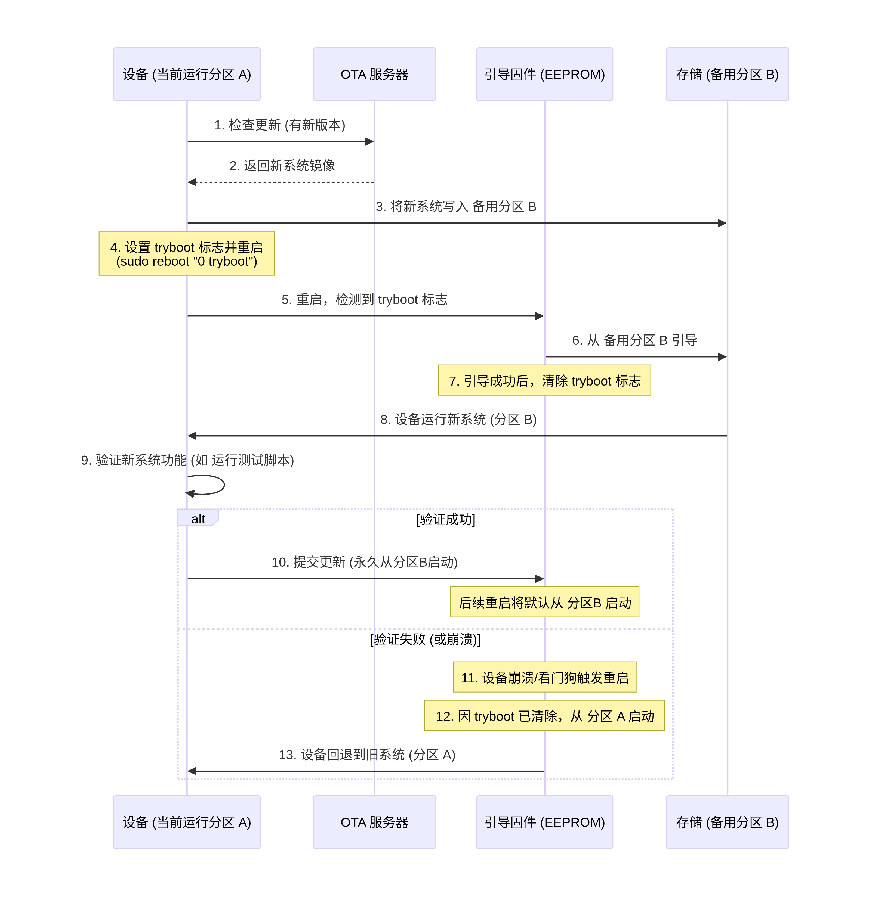

# RPi5 tryboot + RAUC A/B OTA 方案

## 概述

利用 RPi5 固件自带的 `tryboot` 机制实现 A/B 分区 OTA 更新，**完全绕过 U-Boot**，从而消除 RP1 芯片无 U-Boot 驱动带来的网络/USB 限制。




**核心思路**：

- RPi 固件（EEPROM + start4.elf）直接启动 Linux 内核，不经 U-Boot
- 固件的 `tryboot` 提供 one-shot 尝试启动机制
- `autoboot.txt` 管理 A/B 两个启动槽位
- RAUC 负责更新包下载、验证、安装，通过 `vcmailbox` 设置 tryboot 标记
- Linux 内核自带完整 RP1 驱动，启动后网络、USB 全可用

```
┌──────────────────────────────────────────────────────────┐
│                    OTA 服务器 (HTTP/HTTPS)                 │
│                  firmware.example.com                     │
│                   ──── update.raucb ────→                 │
└──────────────────────────────────────────────────────────┘
                            │
                            ▼
┌──────────────────────────────────────────────────────────┐
│                   Raspberry Pi 5                          │
│                                                          │
│  ┌──────────┐    ┌──────────────┐    ┌───────────────┐   │
│  │ RAUC     │    │ RPi Firmware │    │ SD 卡 (MBR)   │   │
│  │ 客户端   │◄──►│ (EEPROM +    │◄──►│ p1: boot_a    │   │
│  │          │    │  start4.elf) │    │    (FAT32)    │   │
│  │ 下载+验 │    │              │    │ p2: boot_b    │   │
│  │ 证+安装 │    │ autoboot.txt │    │    (FAT32)    │   │
│  │          │    │ tryboot flag │    │ p3: rootfs_a  │   │
│  │ vcmailbox│    │ [boot_       │    │ p4: rootfs_b  │   │
│  │          │    │  partition]  │    │ p5: data      │   │
│  └──────────┘    └──────────────┘    └───────────────┘   │
└──────────────────────────────────────────────────────────┘
```

---

## 背景：为什么不用 U-Boot

RPi5 的 GPIO、USB、以太网都经过 **RP1 芯片**（PCIe 南桥），而 U-Boot 2026.07 没有 RP1 驱动。在 U-Boot 下：

- 无网络 → TFTP/NFS 内核加载 ❌
- 无 USB → USB 存储启动 ❌
- 只能从 SD 卡启动 ✅

RPi5 固件（EEPROM + start4.elf）的功能虽然简单，但足够：加载内核、选择 DTB、传递 cmdline。A/B OTA 需要的网络能力（下载更新包）和 GPT 分区管理全部在 Linux 用户空间完成，RP1 驱动在此时已就绪。

---

## tryboot 机制详解

### 原理

`tryboot` 是 RPi 固件提供的 **one-shot 启动尝试** 标记：

```
正常启动:
  EEPROM → 读 autoboot.txt [all] section → 启动对应分区的内核

tryboot 启动 (标记置位时):
  EEPROM → 读 autoboot.txt [tryboot] section → 启动另一个分区的内核
          → 同时自动清除 tryboot 标记
          → 下次启动恢复读 [all] section
```

### autoboot.txt 格式

固件在启动时读取第一个 FAT 分区上的 `autoboot.txt`（若存在），格式与 `config.txt` 相同：

```ini
[all]
tryboot_a_b=1
boot_partition=2

[tryboot]
boot_partition=3
```

- `[all]` — 正常启动时使用，指向当前主 slot 的 boot 分区号
- `[tryboot]` — tryboot 标记置位时使用，指向待验证的新 slot
- `tryboot_a_b=1` — 启用 A/B tryboot 模式
- `boot_partition=N` — 指定从哪个 MBR 分区加载固件和内核（**1-based 编号**）

> **注意**：`boot_partition` 指向的是 **MBR 分区号**（1-based），不是 GPT PARTUUID。RPi 固件原生理解 MBR 分区表，每个 boot 分区必须是 FAT32 格式。

### 设置 tryboot 标记

从 Linux 用户空间通过 VideoCore mailbox 设置：

```bash
# 方法一：vcmailbox（推荐，不需要重启）
vcmailbox 0x00038064 4 0 1

# 方法二：reboot 参数（RAUC 中不推荐，因为会立即重启）
reboot '0 tryboot'
```

`vcmailbox` 使用的 mailbox tag `0x00038064` 是 **Set Reboot Flags** 命令：
- Request: 4 字节，`u32 flags`（bit 0 = tryboot）
- Response: 0 字节
- 依赖 `/dev/vcio` 字符设备（Broadcom 下游内核驱动 `drivers/char/broadcom/vcio.c`，**不在上游内核中**）

### 读取当前启动的分区

固件将启动信息写入 device-tree 的 `/chosen/bootloader/` 节点：

```bash
# 读取当前启动的分区号
fdtget /proc/device-tree/chosen/bootloader partition

# 检查是否为 tryboot 启动
fdtget /proc/device-tree/chosen/bootloader tryboot
```

`/proc/device-tree/chosen/bootloader/partition` 是 1-based MBR 分区号，由固件在启动时自动填充。

---

## SD 卡分区方案

### 分区布局 (MBR)

```
/dev/mmcblk0
├── p1: boot_a  (FAT32, 128MB) — slot A 的固件 + 内核
├── p2: boot_b  (FAT32, 128MB) — slot B 的固件 + 内核
├── p3: rootfs_a (ext4, 512MB) — slot A 根文件系统
├── p4: rootfs_b (ext4, 512MB) — slot B 根文件系统
└── p5: data    (ext4, 剩余)    — 持久数据 (配置、日志、RAUC 状态)
```

> **为什么用 MBR 而非 GPT**：RPi 固件的 `boot_partition` 基于 MBR 分区号。虽然固件也能读取 GPT 分区表，但 MBR 是最兼容的选择。128MB 的 boot 分区在 MBR 下没有 2TB 限制问题。

### 每个 boot 分区的内容

```
boot_a (p1):                  boot_b (p2):
├── start4.elf                ├── start4.elf
├── fixup4.dat                ├── fixup4.dat
├── config.txt                ├── config.txt
├── cmdline.txt               ├── cmdline.txt
├── Image                     ├── Image
├── bcm2712-rpi-5-b.dtb       ├── bcm2712-rpi-5-b.dtb
├── bcm2712d0-rpi-5-b.dtb     ├── bcm2712d0-rpi-5-b.dtb
├── bcm2712-rpi-500.dtb       ├── bcm2712-rpi-500.dtb
└── overlays/                 └── overlays/
```

> 与 U-Boot 方案不同，**不需要共享 boot 分区**。每个 slot 有独立的 boot 分区，包含完整的固件文件、内核、DTB 和 cmdline。这避免了内核和 rootfs 版本不匹配的问题，也使得每个 slot 真正独立。

### autoboot.txt 位置

`autoboot.txt` 放在 **第一个** FAT 分区的根目录。如果在启动时找到此文件，固件会解析它来决定从哪个分区启动。

```
mmcblk0p1 (boot_a):
├── autoboot.txt   ← 固件启动时优先读取
├── start4.elf
├── config.txt
├── cmdline.txt
├── Image
└── ...
```

---

## config.txt 的 [boot_partition=N] 条件

### 问题

`cmdline.txt` 中的 `root=` 参数指向 rootfs 分区。在 A/B 场景下，boot_a 的 `cmdline.txt` 需要 `root=/dev/mmcblk0p3`，boot_b 的需要 `root=/dev/mmcblk0p4`。如果手动维护两个 cmdline 文件，更新时容易出错。

### 解决：`[boot_partition=N]` 条件

RPi EEPROM 固件（**2025-03-10 及之后版本**）支持在 `config.txt` 中使用 `[boot_partition=N]` 条件段：

```ini
# config.txt (两个 boot 分区共用同一份)
kernel=Image
disable_overscan=1

# 根据实际启动分区选择对应的 cmdline 文件
[boot_partition=1]
cmdline=cmdline_a.txt

[boot_partition=2]
cmdline=cmdline_b.txt
```

对应的 cmdline 文件：

```
# cmdline_a.txt
root=/dev/mmcblk0p3 rootwait console=tty1 console=ttyAMA10,115200

# cmdline_b.txt
root=/dev/mmcblk0p4 rootwait console=tty1 console=ttyAMA10,115200
```

> **重要**：`[boot_partition=N]` 中的 N 是 **1-based MBR 分区号**，与实际物理分区号对应。`autoboot.txt` 中的 `boot_partition=` 决定了从哪个分区加载 `config.txt`，然后 `config.txt` 中的 `[boot_partition=N]` 条件再基于**实际启动的分区**选择 cmdline。

### EEPROM 版本检查

```bash
# 检查当前 EEPROM 版本
sudo rpi-eeprom-update
vcgencmd bootloader_version

# 如果版本较老 (早于 2025-03-10)，更新 EEPROM
sudo rpi-eeprom-update -a
sudo reboot
```

---

## RAUC 集成

### 架构

RAUC 没有原生的 RPi 固件后端（PR 在 review 中），需要自定义 bootloader backend。参考实现：[Rtone/raspberrypi-firmware-rauc-bootloader-backend](https://github.com/Rtone/raspberrypi-firmware-rauc-bootloader-backend)。

自定义 backend 是一个 shell 脚本，实现 RAUC 要求的四个接口：

| 操作 | 对应命令 | 实现 |
|---|---|---|
| `get-primary` | 解析 `autoboot.txt` | 读取 `[all]` section 中的 `boot_partition` |
| `set-primary` | 更新 `autoboot.txt` | 交换 `[all]` 和 `[tryboot]` 中的分区号；清除 tryboot 标记 |
| `get-state` | 读 DTB 或 root= | 从 `/proc/device-tree/chosen/bootloader/partition` 获取当前启动分区 |
| `set-state` | 标记 good/bad | 如果 tryboot 成功：交换 `[all]` 和 `[tryboot]`（新版本变主版本） |

### RAUC system.conf

```ini
[system]
compatible=RaspberryPi5-Buildroot
bootloader=custom

[handlers]
bootloader-custom-backend=/usr/lib/rauc/backend/raspberrypi-firmware

# === Slot A ===
[slot.firmware.0]
device=/dev/mmcblk0p1
type=vfat
parent=rootfs.0

[slot.rootfs.0]
device=/dev/mmcblk0p3
type=ext4
bootname=A

# === Slot B ===
[slot.firmware.1]
device=/dev/mmcblk0p2
type=vfat
parent=rootfs.1

[slot.rootfs.1]
device=/dev/mmcblk0p4
type=ext4
bootname=B
```

> **关键设计**：每个 slot 由 firmware (boot 分区) + rootfs 组成，通过 `parent` 关联。更新时一起替换。

### RAUC 自定义 backend 脚本（核心逻辑）

```bash
#!/bin/bash
# /usr/lib/rauc/backend/raspberrypi-firmware
#
# RAUC custom bootloader backend for RPi5 tryboot A/B
# 依赖: vcmailbox, fdtget (来自 dtc 包)

AUTOBOOT="/boot/autoboot.txt"
BOOT_PARTITION_FILE="/proc/device-tree/chosen/bootloader/partition"
TRYBOOT_FILE="/proc/device-tree/chosen/bootloader/tryboot"

# 映射: slot.rootfs.0 → boot_partition=1 (p1), slot.rootfs.1 → boot_partition=2 (p2)
get_boot_partition_for_slot() {
    case "$1" in
        "rootfs.0") echo "1" ;;
        "rootfs.1") echo "2" ;;
    esac
}

get_slot_for_boot_partition() {
    case "$1" in
        "1") echo "rootfs.0" ;;
        "2") echo "rootfs.1" ;;
    esac
}

case "$1" in
    get-primary)
        # 从 autoboot.txt 的 [all] section 读取 boot_partition
        primary_part=$(sed -n '/^\[all\]/,/^\[/s/^boot_partition=//p' "${AUTOBOOT}" | head -1)
        get_slot_for_boot_partition "${primary_part}"
        ;;

    set-primary)
        # 交换 autoboot.txt 中的 [all] 和 [tryboot]，然后清除 tryboot
        # 这意味着新 slot 已经验证成功，变为主 slot
        if [ -f "${TRYBOOT_FILE}" ]; then
            # 当前是 tryboot 启动的，把它变为主
            all_part=$(sed -n '/^\[tryboot\]/,/^\[/s/^boot_partition=//p' "${AUTOBOOT}" | head -1)
            tryboot_part=$(sed -n '/^\[all\]/,/^\[/s/^boot_partition=//p' "${AUTOBOOT}" | head -1)
            sed -i "/^\[all\]/,/^\[/s/^boot_partition=.*/boot_partition=${all_part}/" "${AUTOBOOT}"
            sed -i "/^\[tryboot\]/,/^\[/s/^boot_partition=.*/boot_partition=${tryboot_part}/" "${AUTOBOOT}"
        fi
        ;;

    get-state)
        # 获取当前启动 slot 的状态
        if [ -f "${BOOT_PARTITION_FILE}" ]; then
            boot_part=$(cat "${BOOT_PARTITION_FILE}" | tr -d '\0')
            echo "good"
        else
            echo "bad"
        fi
        ;;

    set-state)
        # 标记 slot 状态: 如果 good，同上交换
        slot="$2"
        state="$3"
        if [ "${state}" = "good" ]; then
            target_part=$(get_boot_partition_for_slot "${slot}")
            # 确保 [all] 指向 good slot
            sed -i "/^\[all\]/,/^\[/s/^boot_partition=.*/boot_partition=${target_part}/" "${AUTOBOOT}"
        fi
        ;;

    get-current)
        # 返回当前启动的 slot
        if [ -f "${BOOT_PARTITION_FILE}" ]; then
            boot_part=$(cat "${BOOT_PARTITION_FILE}" | tr -d '\0')
            get_slot_for_boot_partition "${boot_part}"
        fi
        ;;

    *)
        echo "Unknown command: $1" >&2
        exit 1
        ;;
esac
```

### 触发 tryboot 的脚本

```bash
#!/bin/bash
# /usr/lib/rauc/backend/set-tryboot
# 在 RAUC 安装完新 slot 后调用，设置 tryboot 标记
#
# 需要先交换 autoboot.txt 中的 [all] 和 [tryboot]，
# 这样下一次启动才会尝试新 slot

AUTOBOOT="/boot/autoboot.txt"

# 交换 boot_partition
all_part=$(sed -n '/^\[all\]/,/^\[/s/^boot_partition=//p' "${AUTOBOOT}" | head -1)
tryboot_part=$(sed -n '/^\[tryboot\]/,/^\[/s/^boot_partition=//p' "${AUTOBOOT}" | head -1)

sed -i "/^\[all\]/,/^\[/s/^boot_partition=.*/boot_partition=${tryboot_part}/" "${AUTOBOOT}"
sed -i "/^\[tryboot\]/,/^\[/s/^boot_partition=.*/boot_partition=${all_part}/" "${AUTOBOOT}"

# 设置 tryboot 标记（one-shot，下次启动后自动清除）
vcmailbox 0x00038064 4 0 1
```

---

## 启动流程

```
上电
  │
  ▼
┌─────────────────────────────────────────────────┐
│ EEPROM (BOOT_ORDER: SD → USB → NVMe)           │
│   └→ 扫描 SD 卡，找到 p1 (bootable FAT32)       │
└─────────────────────────────────────────────────┘
  │
  ▼
┌─────────────────────────────────────────────────┐
│ 固件读 p1/autoboot.txt                          │
│   ├ tryboot 标记 = 0 → 读 [all]  section       │
│   │   boot_partition=1 → 从 p1 启动             │
│   └ tryboot 标记 = 1 → 读 [tryboot] section    │
│       boot_partition=2 → 从 p2 启动             │
│       同时: 自动清除 tryboot 标记               │
└─────────────────────────────────────────────────┘
  │
  ▼
┌─────────────────────────────────────────────────┐
│ 固件读对应分区的 config.txt                      │
│   kernel=Image                                   │
│   [boot_partition=N] → cmdline=cmdline_X.txt     │
└─────────────────────────────────────────────────┘
  │
  ▼
┌─────────────────────────────────────────────────┐
│ 固件加载 Image + DTB 到内存                     │
│   传递 cmdline_X.txt 中的参数给内核              │
│   跳转到内核入口                                │
└─────────────────────────────────────────────────┘
  │
  ▼
┌─────────────────────────────────────────────────┐
│ Linux 内核启动                                  │
│   RP1 驱动初始化 → 网络/USB 就绪                │
│   挂载 root=/dev/mmcblk0pN                      │
│   /sbin/init 启动                               │
└─────────────────────────────────────────────────┘
  │
  ▼
┌─────────────────────────────────────────────────┐
│ 用户空间                                        │
│   RAUC service 启动                             │
│   获取当前 slot → 检查状态                      │
│   如果是 tryboot 启动且启动成功:                 │
│     → rauc status mark-good                    │
│     → backend set-state good                   │
│     → 新版本变为主版本                          │
└─────────────────────────────────────────────────┘
```

### mark-good 时机

与 U-Boot 方案不同，tryboot **只有一次尝试机会**（one-shot）。如果 tryboot 启动失败（内核 panic、看门狗超时）：

1. 硬件看门狗触发复位
2. 固件重新启动，但 tryboot 标记已在上次启动时清除
3. 固件读 `[all]` section → 自动回退到旧版本

因此 `rauc status mark-good` **必须在确认系统正常后尽快调用**。建议：

```bash
# /etc/init.d/S99rauc-mark-good 或 systemd service
# 在以下条件满足后再标记 good:
#   - 网络已连通
#   - 关键服务已启动
#   - 等待一段稳定运行时间（如 30 秒）

(sleep 30 && rauc status mark-good) &
```

> **注意**：如果 mark-good 从未被调用，RPi 固件不会自动回退（它没有 bootcount），只是下次正常启动会继续用 `[all]` 中的旧版本。tryboot 的 one-shot 特性意味着：**新版本必须在其唯一的一次启动机会中成功并 mark-good**，否则等于白更新。

---

## Buildroot 集成

### 需要的修改

基于现有的 `raspberrypi5_defconfig`，需要：

#### 1. 新的 board 目录结构

```
board/raspberrypi5/
├── ab-ota/
│   ├── autoboot.txt              ← A/B 启动配置
│   ├── config.txt                ← 带 [boot_partition=N] 条件
│   ├── cmdline_a.txt             ← slot A 的 cmdline
│   ├── cmdline_b.txt             ← slot B 的 cmdline
│   ├── rauc-backend.sh           ← RAUC custom backend 脚本
│   └── system.conf               ← RAUC 配置
├── genimage-ab-ota.cfg.in        ← A/B 分区布局 genimage 模板
└── post-image-ab-ota.sh          ← 构建后处理脚本
```

#### 2. autoboot.txt

```ini
[all]
tryboot_a_b=1
boot_partition=1

[tryboot]
boot_partition=2
```

#### 3. config.txt

```ini
kernel=Image
disable_overscan=1
arm_64bit=1

# 每个 boot 分区有各自的 cmdline，通过分区条件选择
[boot_partition=1]
cmdline=cmdline_a.txt

[boot_partition=2]
cmdline=cmdline_b.txt
```

#### 4. genimage-ab-ota.cfg.in

```
image boot_a.vfat {
    vfat {
        files = {
#BOOT_A_FILES#
        }
    }
    size = 128M
}

image boot_b.vfat {
    vfat {
        files = {
#BOOT_B_FILES#
        }
    }
    size = 128M
}

image sdcard.img {
    hdimage {
        # MBR 分区表
    }

    partition boot_a {
        partition-type = 0xC
        bootable = "true"
        image = "boot_a.vfat"
    }

    partition boot_b {
        partition-type = 0xC
        image = "boot_b.vfat"
    }

    partition rootfs_a {
        partition-type = 0x83
        image = "rootfs.ext4"
    }

    partition rootfs_b {
        partition-type = 0x83
        image = "rootfs.ext4"
    }

    partition data {
        partition-type = 0x83
        image = "data.ext4"
    }
}
```

#### 5. Buildroot .config 关键项

```
# ====== 分区工具 ======
BR2_PACKAGE_HOST_GENIMAGE=y
BR2_PACKAGE_HOST_UBOOT_TOOLS=n       # 不需要 U-Boot 了

# ====== RAUC ======
BR2_PACKAGE_RAUC=y
BR2_PACKAGE_RAUC_NETWORK=y

# ====== DTC (提供 fdtget, 读取固件 DTB) ======
BR2_PACKAGE_DTC=y
BR2_PACKAGE_DTC_PROGRAMS=y

# ====== rpi-firmware ======
BR2_PACKAGE_RPI_FIRMWARE=y
BR2_PACKAGE_RPI_FIRMWARE_CONFIG_FILE="board/raspberrypi5/ab-ota/config.txt"

# ====== rootfs ======
BR2_TARGET_ROOTFS_EXT2=y
BR2_TARGET_ROOTFS_EXT2_4=y
BR2_TARGET_ROOTFS_EXT2_SIZE="512M"
BR2_TARGET_ROOTFS_TAR=y

# ====== 内核 ======
BR2_LINUX_KERNEL=y
BR2_LINUX_KERNEL_CUSTOM_TARBALL=y
# ... 使用 RPi 内核或 mainline

# ====== 额外依赖 ======
BR2_PACKAGE_UTIL_LINUX=y
BR2_PACKAGE_UTIL_LINUX_LIBFDISK=y
BR2_PACKAGE_LIBCURL=y          # RAUC 网络下载

# ====== watchdog ======
BR2_PACKAGE_WATCHDOG=y         # 硬件看门狗，确保启动失败时自动复位
```

#### 6. 构建流程

```bash
#!/bin/bash
# scripts/build-ab-ota.sh
set -e

BUILDROOT_DIR="$(cd "$(dirname "$0")/.." && pwd)"
OUTPUT="${BUILDROOT_DIR}/output/images"
BOARD_DIR="${BUILDROOT_DIR}/board/raspberrypi5/ab-ota"
VERSION=$(date +%Y%m%d-%H%M%S)

cd "${BUILDROOT_DIR}"

# 1. 构建 Buildroot
make -j$(nproc)

# 2. 准备 boot 分区文件 (两份)
for SLOT in A B; do
    BOOT_DIR="${OUTPUT}/boot_${SLOT,,}"
    mkdir -p "${BOOT_DIR}"
    cp "${OUTPUT}"/rpi-firmware/*.elf "${BOOT_DIR}/"
    cp "${OUTPUT}"/rpi-firmware/*.dat "${BOOT_DIR}/"
    cp "${OUTPUT}"/rpi-firmware/config.txt "${BOOT_DIR}/"
    cp "${OUTPUT}"/rpi-firmware/cmdline_${SLOT,,}.txt "${BOOT_DIR}/"
    cp "${OUTPUT}"/Image "${BOOT_DIR}/"
    cp "${OUTPUT}"/*.dtb "${BOOT_DIR}/"
    cp -r "${OUTPUT}"/rpi-firmware/overlays "${BOOT_DIR}/"
done

# 3. 复制 autoboot.txt 到 boot_a (第一个分区)
cp "${BOARD_DIR}/autoboot.txt" "${OUTPUT}/boot_a/"

# 4. 生成 RAUC bundle
cd "${OUTPUT}"
cat > manifest.raucm <<EOF
[update]
compatible=RaspberryPi5-Buildroot
version=${VERSION}

[image.rootfs]
filename=rootfs.ext4

[image.firmware]
filename=boot_a.vfat
EOF

rauc bundle \
    --cert="${BOARD_DIR}/signing.cert.pem" \
    --key="${BOARD_DIR}/signing.key.pem" \
    . \
    "update-${VERSION}.raucb"

echo "=== 构建完成 ==="
echo "SD 卡镜像: ${OUTPUT}/sdcard.img"
echo "更新包:    ${OUTPUT}/update-${VERSION}.raucb"
```

#### 7. 首次烧录 SD 卡

```bash
# 首次部署，烧录完整的 sdcard.img (包含两个 boot + 两个 rootfs + data)
sudo dd if=output/images/sdcard.img of=/dev/sdX bs=4M status=progress conv=fsync
```

#### 8. 更新操作

```bash
# 在设备上从 HTTP 服务器下载并更新
rauc install http://firmware.example.com/ota/update-latest.raucb

# RAUC 会自动：
#   1. 确定当前活跃 slot
#   2. 写入非活跃 slot 的 boot + rootfs
#   3. 调用 post-install hook 设置 tryboot
#   4. 重启

# 系统启动后验证更新
rauc status
rauc status mark-good
```

---

## 开发调试阶段：tryboot + NFS

开发阶段依旧可以用 NFS rootfs 加速迭代，且不需要 U-Boot。

### 方案：固定 boot 分区 + NFS rootfs，tryboot 用于切换

```
SD 卡:
├── p1: boot_dev     (FAT32, 128MB)  — 开发用，固定启动
├── p2: rootfs_dev_a (ext4, 256MB)   — 最小系统 (备用)
└── p3: rootfs_dev_b (ext4, 256MB)   — 最小系统 (备用)

boot_dev 分区:
├── autoboot.txt        ← [all] boot_partition=1 (固定)
├── config.txt
├── cmdline_nfs.txt     ← root=/dev/nfs nfsroot=192.168.2.1:/nfsroot/rpi5 ...
├── cmdline_local.txt   ← root=/dev/mmcblk0p2 (回退用)
├── Image
├── *.dtb
└── start4.elf, fixup4.dat
```

开发循环：

```
host$ make -j$(nproc)                     # 编译
host$ ./deploy.sh                         # 复制 rootfs 到 /nfsroot, Image 到 boot 分区
  → scp Image root@pi:/boot/
  → sudo tar xf rootfs.tar -C /nfsroot/rpi5/

host$ ssh root@pi reboot                  # 重启 → 内核通过 NFS 挂载新的 rootfs
```

`deploy.sh`：

```bash
#!/bin/bash
# 部署到设备 (NFS 开发模式)
PI_IP="192.168.2.100"
NFSROOT="/nfsroot/rpi5"
IMAGES="output/images"

echo "=== 部署内核到设备 ==="
ssh root@${PI_IP} "mount -o remount,rw /boot"
scp ${IMAGES}/Image root@${PI_IP}:/boot/
scp ${IMAGES}/*.dtb root@${PI_IP}:/boot/

echo "=== 部署 rootfs 到 NFS ==="
sudo rm -rf ${NFSROOT}/*
sudo tar xf ${IMAGES}/rootfs.tar -C ${NFSROOT}/
sync

echo "=== 完成 ==="
ssh root@${PI_IP} reboot
```

---

## 与 U-Boot A/B 方案的对比

| 维度 | U-Boot 方案（方案二） | tryboot 方案（方案三） |
|---|---|---|
| **网络 (U-Boot 中)** | ❌ RP1 无驱动 | N/A — 固件不涉及网络 |
| **网络 (Linux 中)** | ✅ 完整支持 | ✅ 完整支持 |
| **boot 分区** | 共享 1 个 FAT 分区 | 每个 slot 独立 FAT 分区 |
| **内核更新方式** | RAUC 写同一分区的 `Image.A` / `Image.B` | RAUC 写对应 slot 的整个 boot 分区 |
| **A/B 选择逻辑** | U-Boot boot.scr 脚本 (灵活) | autoboot.txt + tryboot (固定) |
| **启动尝试计数** | ✅ bootcount (多次重试) | ❌ one-shot (只有一次尝试) |
| **自动回滚** | ✅ U-Boot 检测 bootcount 超限 | ✅ 固件：tryboot 失败后自动回退到 [all] |
| **环境变量存储** | FAT 上的 `uboot.env` | 固件内部标记 (用户不可控) |
| **固件依赖** | 任何版本 | 需要 EEPROM ≥ 2025-03-10 (支持 [boot_partition]) |
| **RAUC 集成** | 使用 U-Boot backend (内置) | 需要自定义 backend |
| **vcio 驱动依赖** | 不需要 | 需要 (`/dev/vcio` 用于 vcmailbox) |
| **复杂度** | 中（U-Boot 配置 + 启动脚本） | 中低（固件原生功能 + 脚本） |
| **RPi5 验证状态** | U-Boot 启动已验证，A/B 未验证 | Bootlin 有完整验证 |
| **上游支持** | U-Boot 主线不完整 (缺 RP1) | RPi 官方功能 |

### 选择建议

- **方案二（U-Boot）**：适合需要 `bootcount` 多次重试机制、或者需要用 U-Boot shell 做复杂启动逻辑的场景。前提是验证 `saveenv` 在 RPi5 上正常工作。
- **方案三（tryboot）**：适合希望尽量简单、用 RPi 原生功能、不需要 U-Boot 的额外复杂度。one-shot 机制对于大多数嵌入式 OTA 场景足够——如果内核能启动到用户空间，就能 `mark-good`。

---

## 限制与注意事项

### 1. 没有 bootcount

tryboot 是 one-shot：新版本只有一次启动机会。如果内核 panic 发生在 `mark-good` 之前，系统回到旧版本，更新包需要重新下载安装。对于网络稳定、更新包已验证的场景，这不是大问题。

### 2. `/dev/vcio` 依赖

`vcmailbox` 依赖 Broadcom 下游内核中的 `drivers/char/broadcom/vcio.c` 驱动。这个驱动**不在 Linux 主线中**。使用 Buildroot 的 RPi 内核分支（`BR2_LINUX_KERNEL_DEFCONFIG="bcm2712"`）自然支持。

### 3. MBR 分区限制

方案使用 MBR 分区表（固件 `boot_partition` 基于 MBR 分区号）。MBR 最多 4 个主分区。如果需要更多分区（如额外的 recovery 分区），需要改用 GPT + 混合 MBR（hybrid MBR）或改用 `PARTUUID=`。

### 4. EEPROM 版本

`[boot_partition=N]` 条件在 **rpi-eeprom 2025-03-10** 及之后版本才支持。旧版 EEPROM 需要手动维护两份不同的 `config.txt` 和 `cmdline.txt`。

### 5. RAUC backend 尚未官方支持

截至 2026.07，RAUC 的 RPi 固件 backend PR 仍在 review 中。自定义 backend 脚本已验证可用，但需要随 RAUC 版本更新进行兼容性维护。

### 6. 固件文件同步

每个 boot 分区必须包含完整的固件文件（`start4.elf`、`fixup4.dat`）。当 RPi 固件更新时（如 `rpi-firmware` 包版本升级），两个 boot 分区都需要更新。

---

## 验证清单

在正式使用前，建议验证以下场景：

- [ ] `autoboot.txt` 正常启动（不设 tryboot）
- [ ] `vcmailbox 0x00038064 4 0 1` 成功设置 tryboot 标记
- [ ] tryboot 启动到新 slot 成功
- [ ] tryboot 启动后 `[boot_partition=N]` 条件正确选择 cmdline
- [ ] `fdtget /proc/device-tree/chosen/bootloader/partition` 返回正确的分区号
- [ ] RAUC 安装更新包到非活跃 slot 成功
- [ ] RAUC `mark-good` 后 autoboot.txt 更新正确
- [ ] 模拟新版本启动失败（故意写错误的 rootfs）→ 自动回到旧版本
- [ ] 看门狗在启动失败时能触发复位
- [ ] EEPROM 版本 ≥ 2025-03-10

---

## 参考链接

- [Safe updates using RAUC on Raspberry Pi 5 — Bootlin](https://bootlin.com/blog/safe-updates-using-rauc-on-raspberry-pi-5/)
- [Rtone/raspberrypi-firmware-rauc-bootloader-backend](https://github.com/Rtone/raspberrypi-firmware-rauc-bootloader-backend)
- [RAUC 官方文档 — Custom Bootloader Backend](https://rauc.readthedocs.io/en/latest/integration.html#custom-bootloader-backend)
- [RPi config.txt 文档](https://www.raspberrypi.com/documentation/computers/config_txt.html)
- [RPi EEPROM 更新指南](https://www.raspberrypi.com/documentation/computers/raspberry-pi.html#bootloader-eeprom)
- [Ubuntu piboot-try A/B boot](https://discourse.ubuntu.com/t/call-for-testing-a-b-boot-on-raspberry-pi/64173)
